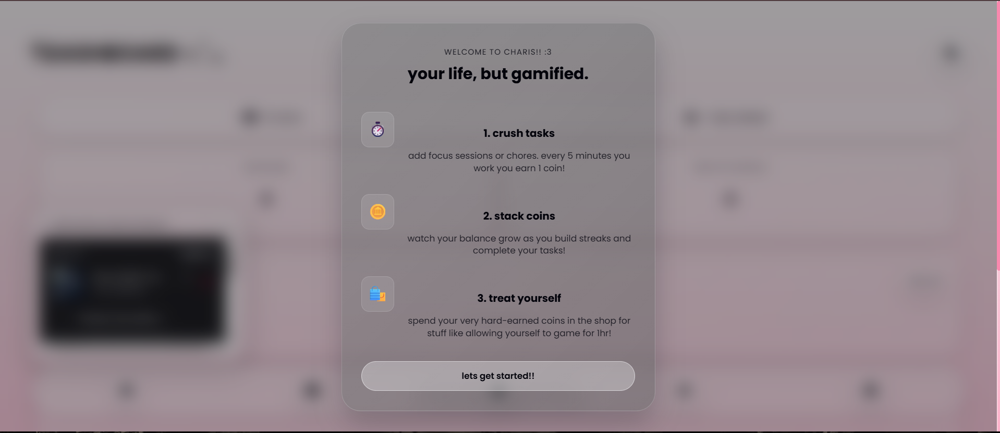
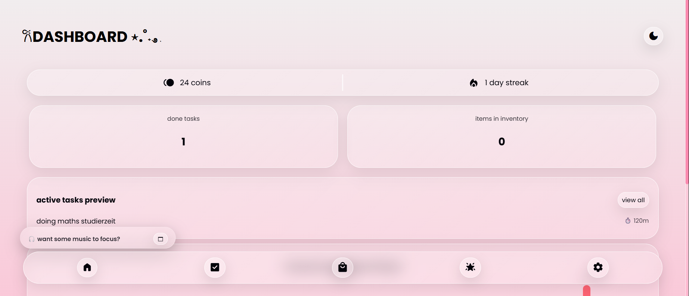
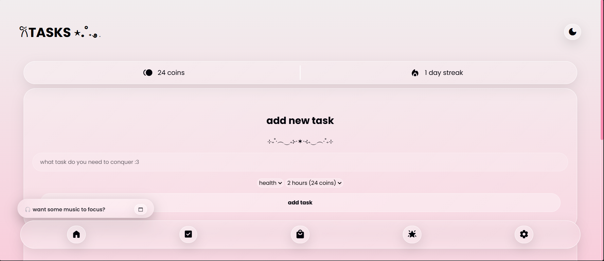
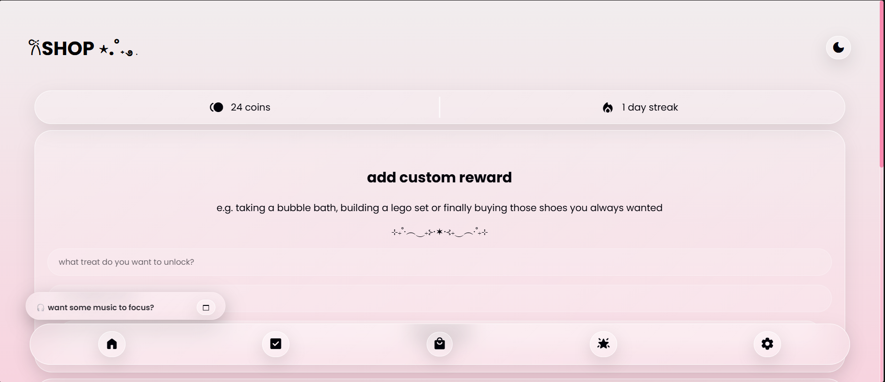
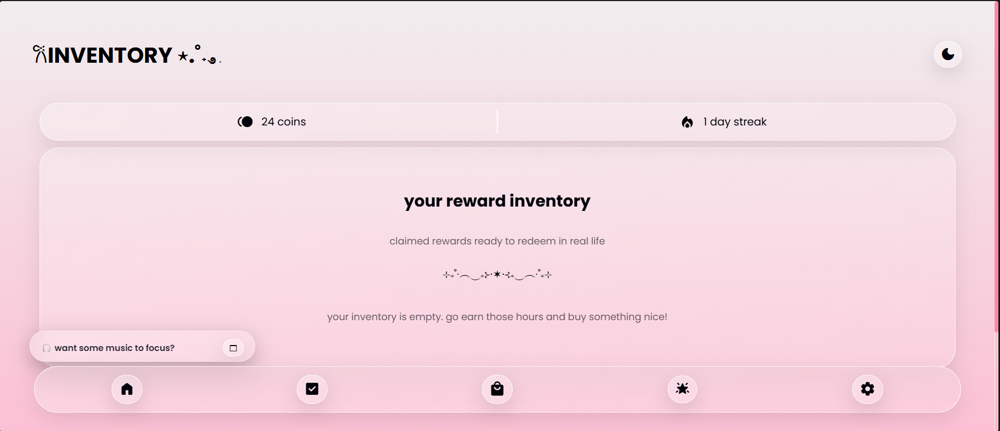
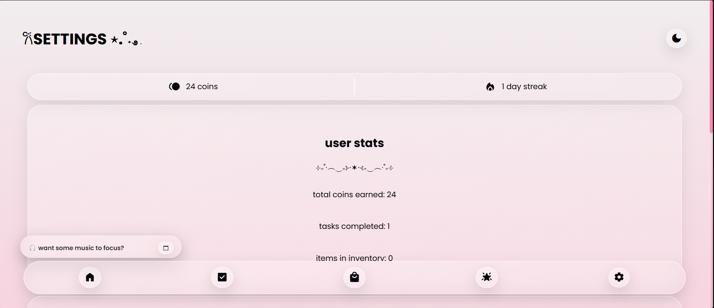
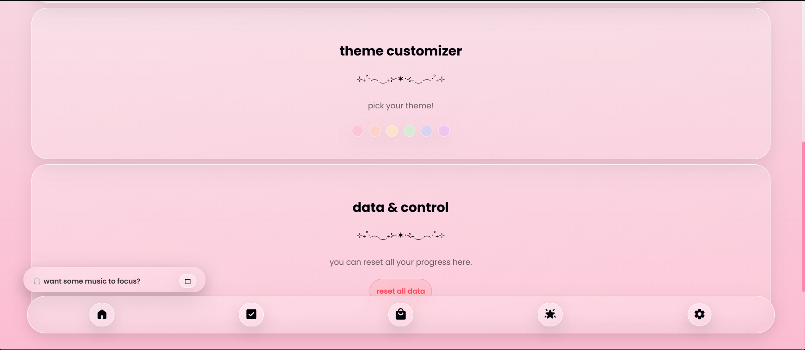
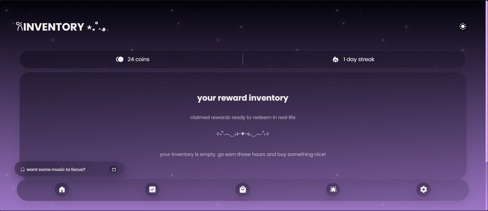
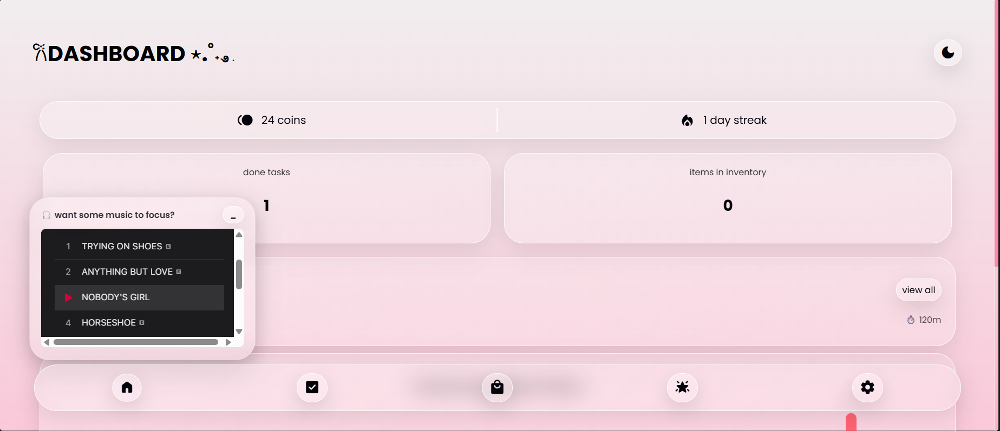

# 𐙚charis - lifeRPG ⋆.˚˖࿔ ࣪
heyyyyy!! this is the lifeRPG web-app i built for horizons ^^

୨୧ ⏔⏔⏔⏔♡⏔⏔⏔⏔ ୨୧ 

## ✧ about the project °❀.ೃ࿔*
i built this web-app bc i personally enjoy gamifying my school work and other obligations and i also recently started with the rewards system which i found really helpful to stay motivated. also, i kinda got inspired by the ysws system lol so that i implemented smth similar in the app.

୨୧ ⏔⏔⏔⏔♡⏔⏔⏔⏔ ୨୧ 

## how the app works  𑣲⋆｡˚ ⟡˖ ࣪
when u first open the app u encounter the onboarding screen on which the basic logic of the app is explained...

after that you will encounter the dashboard... here you can get an overview over your progress by viewing stuff like how many tasks u finished, number of items in inventory, preview of ur active tasks and a graph that shows how many minutes u focused in the past 5 days...

if u decided to use the nav bar lol then u may encounter the tasks screen as it is represented by the second button on there hahaha... here u can add a new task by giving it a title, category and the approximate amount of time it will take aka how many coins u need to finally get ur reward... below that youll find the active task that u can either complete or delete if you ever feel the need to do so...

after that comes the shop screen... here u can add a custom reward with the amount of coins u want to earn to redeem it (pls dont set it to 1)... below that u can find an overview of the available rewards that u can buy in the shop with their respective prices... u can also remove those as well if ur unhappy with the preset ones or the ones u created earlier lol...

next comes the inventory screen where u can basically view ur previously bought rewards and redeem them if u completed them or refund them if you like...

the last screen is the settings screen... here u can first of all view ur user stats meaning stuff like ur total coins earned, ur completed tasks or how many items u have in ur inventory... below that u can set the accent color/theme of the app to ur preference (i can recommend the purple a lot hahah)... below that u can ofc reset all ur data and do a fresh start ig lol... 

also on the top right corner u can change from light to dark mode and the other way around... heres how the dark mode looks like with the purple theme combined: 

also on the bottom left corner just above the navbar is a small apple music widget that can play SCTW deluxe lol if u want to listen to izt to focus like i do hahahahahaha

୨୧ ⏔⏔⏔⏔♡⏔⏔⏔⏔ ୨୧ 

## 🛠 tech stack ｡𖦹°꩜.ೃ࿔
* html5
* css3
* javascript
* github pages for hosting

୨୧ ⏔⏔⏔⏔♡⏔⏔⏔⏔ ୨୧ 

## features im most proud of lol
* the small music player at the left bottom corner ⋆˚࿔♪˚⊹
* the stars that appear when ur in dark mode
* the reward shop <3
* how cute it turned out yayy

## problems that occured while coding ⋆｡˚𑣲⋆｡˚
* really saving EVERYTHING in the localStorage so that no data gets lost somehow took so much time and brain capacity
* implementing the music widget was also not as easy as i thought hahahha
* also functions like removing tasks/rewards/inventory items and like the total coins earned or minutes focused were sorta hard to code lol
* lastly, uhmmmm being disciplined and coding to get my hours cough cough

୨୧ ⏔⏔⏔⏔♡⏔⏔⏔⏔ ୨୧ 

## AI disclosure ⋆✴︎˚｡⋆
i used ai to write a to do list of all the features i wanted to add. moreover, i used it to help me with debugging :)

୨୧ ⏔⏔⏔⏔♡⏔⏔⏔⏔ ୨୧ 

## setup instructions ⋅°❀⋆.ೃ࿔*:･
* download or clone this repo
* open the index.html file in ur browser or editor by double clicking it (while keeping the folder structure as it is)
* anddddd ur good to go (the web-app should open in ur browser or built-in viewer)

୨୧ ⏔⏔⏔⏔♡⏔⏔⏔⏔ ୨୧ 

## ₊˚⊹ ࿔ how to visit
u can now check out the live online version here: **https://daliisalm22.github.io/life-rpg/**

୨୧ ⏔⏔⏔⏔♡⏔⏔⏔⏔ ୨୧ 

## ೄྀ app demo video ^^

warning: i didnt realize the music i listened to while filming would also be in the video and its kinda too late to remove it soooo yeahhh lol (song name is trying on shoes by tate mcrae)

https://github.com/user-attachments/assets/cafdd062-3d04-44fe-8089-361d83f8f837

୨୧ ⏔⏔⏔⏔♡⏔⏔⏔⏔ ୨୧ 

## i hope u enjoy using the app!! ⋆𐙚₊˚⊹♡
